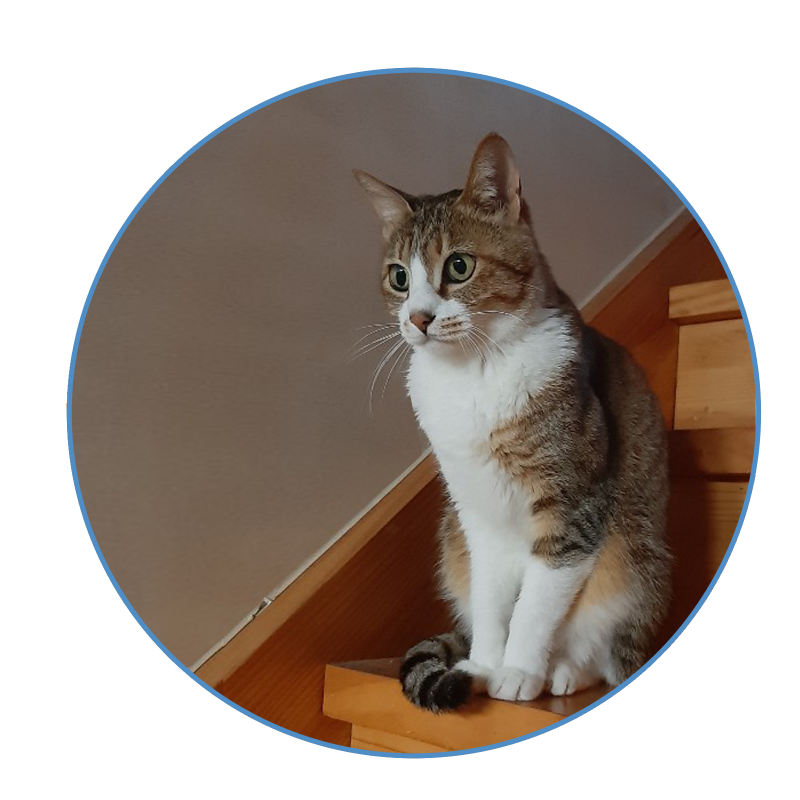
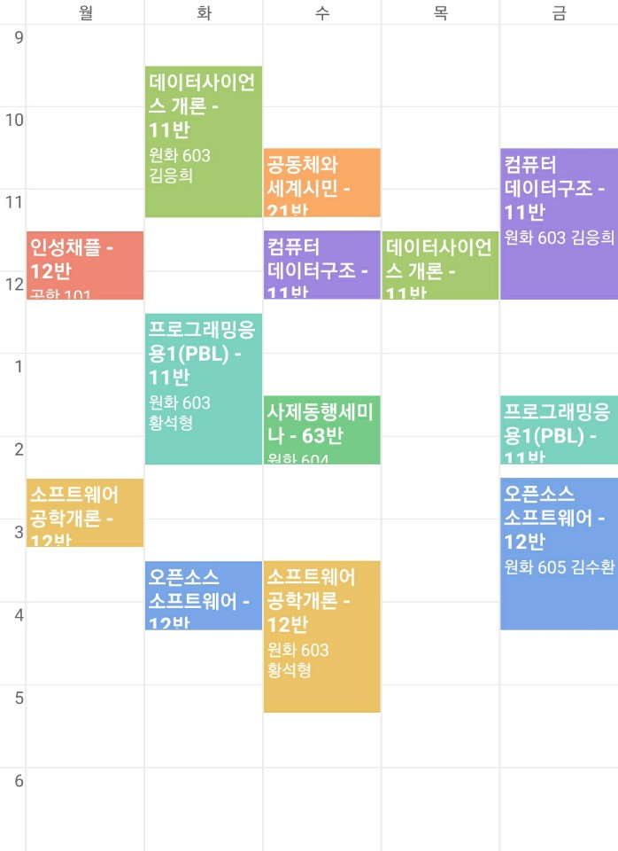

# 1. 자기소개  

<details>
<summary>: 안녕하세요. 저는...</summary>
<div markdown="1">

-----  
-----  

안녕하세요. 저는 조은채입니다.  
지금 선문대학교 글로벌소프트웨어 학과에 재학 중입니다.  

처음에 이 학과를 선택했을 때 '진도를 따라갈 수 있을까?', '적성에 맞을까?'하는 고민을 했었습니다.  
하지만 지금은 전공 공부가 꽤 재미있고, 부질없는 고민이었구나 싶습니다.  

딱 하나, 고민(?)이 있다면 학교가 집이랑 멀다는 것입니다.  

-----  

저희 집에는 고양이가 두 마리 있습니다.  
처음 보는 사람은 둘이 똑같이 생겼다고 하지만, 자세히 보면 꽤 다른 점이 있다는 것을 알 수 있습니다.  
그래서 학교가 집이랑 멀다는 것이 고민인 이유는 바로 고양이 때문입니다.  

학기 중에는 고양이를 자주 볼 수가 없으니까요......  
~~사실 고양이 자랑하려고 고민이라고 한거에요ㅎㅎㅎ~~  



-----  

최근 코로나 때문에 밖에 잘 못나가서 생긴 취미가 하나있는데요.  
바로 칼림바 연주입니다.  
칼림바는 가느다란 철판을 여러 개 달아놓은 타악기입니다.  
원래 악기에는 별 관심이 없었는데 유튜브 채널 [**'위키위키(WIKIWIKI)'**](https://www.youtube.com/user/WIKIWIKISHOP)를 보고 나서 '저건 사야해!'하는 생각이 들어서 사버렸죠.  

지금 연주할 수 있는 곡은  
  1. See you again  
  2. Summer - 기쿠로지의 여름 OST  
두 곡입니다.  

칼림바 외에 원래 가지고 있던 취미로는 뜨개질, 페이터 커팅, 피포 페인팅(ex. 명화 그리기) 정도가 있습니다.  

-----  

*연락처*  
|전화번호|e-mail|  
|:-----------:|:-----------------:|  
|010-3940-XXXX|dmsco9835@naver.com|  
</div>
</details>


-----   
# 2. 2020-1학기  

<details>
<summary>: 이번 학기 시간표와 배운 과목</summary>
<div markdown="1">
 
-----  
-----  

이번 학기 시간표입니다.  
  

-----

> **< 교양 >**  
> 0. 인성채플  
>   - 애천,애인,애국의 건학이념을 중심으로 학생들에게 올바른 인생관, 역사관, 세계관 등을 교육하여 참된 인격자를 양성하는데 그 목적이 있다.  
> 
> 0. 사제동행세미나  
>   - 애천,애인,애국의 건학이념을 중심으로 학생들에게 올바른 인생관, 역사관, 세계관 등을 교육하여 참된 인격자를 양성하는데 그 목적이 있다.  
>
> 0. 공동체와 세계시민  
>   - 공동체와 세계시민에 대한 개념을 정립하고 공감대를 형성한다.  
>   - 공동체 단위로 글로벌 이슈에 대한 문제들을 스스로 찾아서 이해하고, 나눔과 배려, 협력정신으로 지속가능한 지구공동체의 글로벌 리더로서 기본적인 소양을 습득한다.  


> **< 전공 >**  
> 1. 컴퓨터 데이터구조  
>   - 데이터 구조의 핵심이라 할 수 있는, 연결리스트, 스택과 큐, 트리(탐색 트리 포함), 해시 테이블, 정렬 및 그래프에 대한 이론적인 지식을 습득하고, 각 데이터 구조를 python을 기반으로 실제 구현해 봄으로써, 실무적인 역량 향상을 강의 목표로 한다.  
> 
> 1. 데이터사이언스개론  
>   - 데이터를 기반으로 세상을 바라볼 수 있는 관점을 배양하고, 비 구조화된 문제의 구조화 및 문제 분할 능력을 갖추며, 다양한 분석 방법론과 분석 도구를 활용할 수 있는 능력 습득을 강의 목표로 한다.  
> 
> 1. 프로그래밍응용1(PBL)  
>   - 객체지향의 기본개념을 토대로 Java프로그래밍 기법을 이해할 수 있다.  
>   - 객체지향 소프트웨어개발과 관련된 제반문제들을 이해하고 해결할 수 있다.  
> 
> 1. 소프트웨어 공학개론  
>   - 소프트웨어공학의 기본개념을 이해하고 설명할 수 있다.  
>   - 소프트웨어 요구사항을 분석할 수 있다.  
>   - 객체지향의 기본개념을 이해하고 설명할 수 있다.  
> 
> 1. 오픈소스 소프트웨어  
>   - 오픈소스 소프트웨어는 이제 거스를 수 없는 대세로 자리 잡았다. 오픈소스 소프트웨어 없이 맨바닥부터 코딩을 한다는 것은 상상할 수도 없고, 우리가 매일 사용하는 소프트웨어 중에서도 소스코드가 공개되어 있는 것들이 매우 많다. 오픈소스 소프트웨어는 이제 IT 산업의 중심으로 자리 잡았다. 본 강의에서는 이러한 시대적 환경 속에서 사용자로서 개발자로서 그리고 협업자로서 오픈소스 커뮤니티 활동에 참여하고 기여할 수 있는 소프트웨어 역량을 높이는 것을 목표로 한다.  

</div>
</details>


----- 
# 3. 이번 학기에 인상 깊었던 내용  

<details>
<summary>: 피보나치 수열</summary>
<div markdown="1">

-----  
-----  

간단한 코드가 더 효율적이고 빠를 거라고 생각했는데, 이 피보나치 수열을 계산하는 프로그램을 통해 코드의 길이와 성능이 비례하지 않다는 것을 알게 되었습니다.  

1. 짧은 코드  
```
def fib(n):
    if n < 3:
        return 1
    else:
        return (fib(n-1) + fib(n-2))
```

2. 긴 코드  
```
def new_fib(n):
    if n < 3:
        return 2
    else:
        prev_prev = 1
        prev = 1
        for i in range(3, n + 1):
            new = prev + prev_prev
            prev_prev = prev
            prev = new
    return new
```

</div>
</details>
